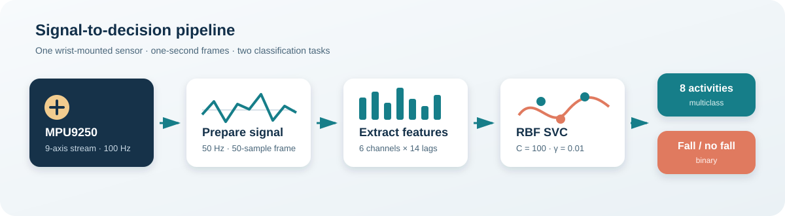
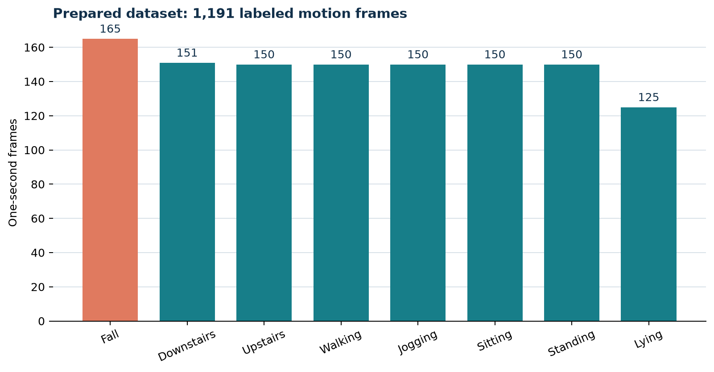
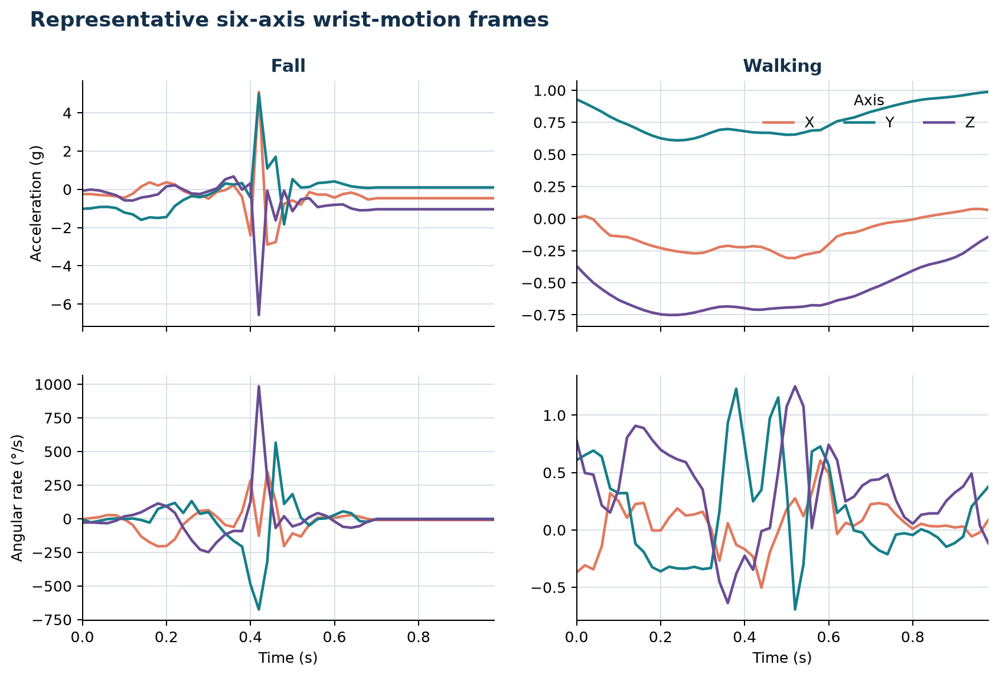
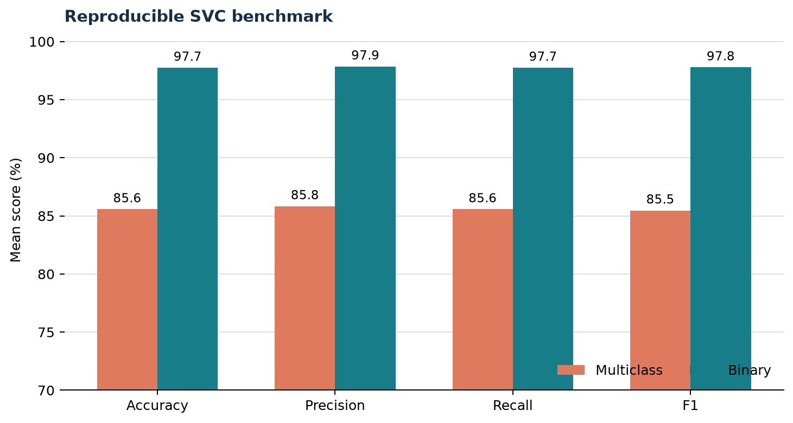
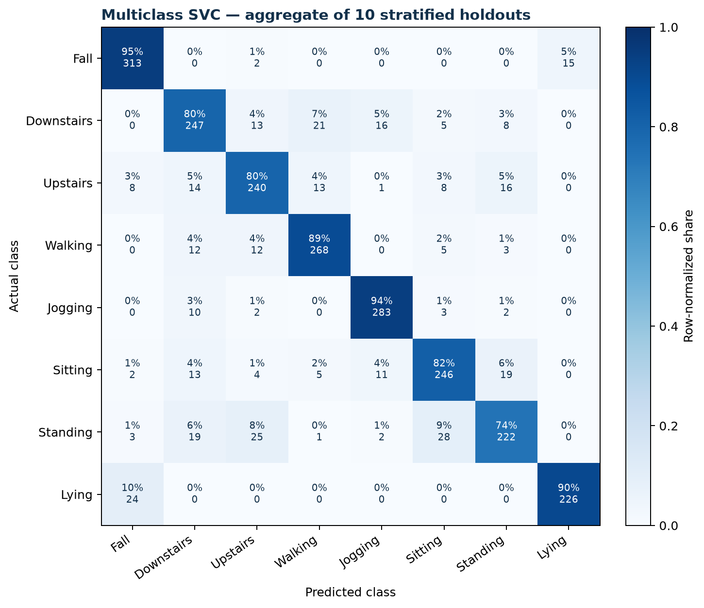
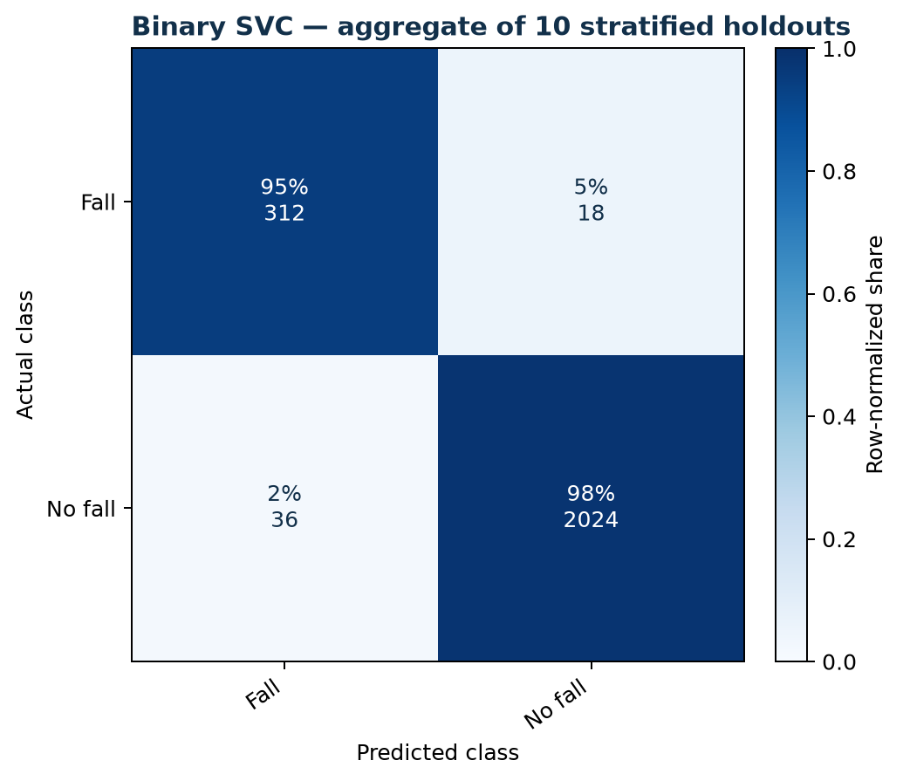

# Wearable Fall Detection

Fall and daily-activity classification from one-second wrist-worn inertial sensor frames. The project combines an MPU9250 acquisition program, signal preparation utilities, autocorrelation features, and support-vector classifiers for multiclass activity recognition and binary fall detection.

## System overview

<p align="center">
  
</p>

The recorded motion stream is reduced from 100 Hz to 50 Hz, standardized to one-second frames, and represented by autocorrelation coefficients at lags 1–14. Each frame produces 84 features: 14 lags across three accelerometer and three gyroscope channels.

## Dataset

The repository contains 1,191 labeled frames. Every CSV file contains 50 samples and six channels in this order:

`acceleration_x`, `acceleration_y`, `acceleration_z`, `gyroscope_x`, `gyroscope_y`, `gyroscope_z`

<p align="center">
  
</p>

| Activity | Frames |
|---|---:|
| Fall | 165 |
| Downstairs | 151 |
| Upstairs | 150 |
| Walking | 150 |
| Jogging | 150 |
| Sitting | 150 |
| Standing | 150 |
| Lying | 125 |

The fall recordings cover forward, backward, lateral, and vertical falls. The daily-activity frames cover walking, jogging, stair movement, sitting, standing, and lying.

See [dataset documentation](docs/dataset.md) for the file schema and activity mapping.

## Signal characteristics

<p align="center">
  
</p>

Fall frames show concentrated acceleration and angular-rate transients. Walking frames exhibit lower-amplitude periodic motion over the same one-second interval.

## Classification

Two RBF support-vector classifiers use the same 84-feature representation:

| Task | Classes |
|---|---|
| Multiclass activity recognition | Fall, downstairs, upstairs, walking, jogging, sitting, standing, lying |
| Binary fall detection | Fall, no fall |

The classifier configuration is `SVC(C=100, kernel="rbf", gamma=0.01)`. Repository benchmarks use ten deterministic, stratified 80/20 holdout splits.

<p align="center">
  
</p>

| Task | Accuracy | Precision | Recall | F1 |
|---|---:|---:|---:|---:|
| Multiclass | 85.6% | 85.8% | 85.6% | 85.5% |
| Binary | 97.7% | 97.9% | 97.7% | 97.8% |

<p align="center">
  
</p>

<p align="center">
  
</p>

The publication reports 87.2% multiclass accuracy and 98.3% binary accuracy. The repository benchmark fixes all split seeds and reports its protocol separately in [methodology](docs/method.md).

## Run the project

Python 3.10 or later is required.

```bash
python -m venv .venv
source .venv/bin/activate        # Windows: .venv\Scripts\activate
python -m pip install -e ".[dev]"
```

Validate every frame and rebuild the dataset manifest:

```bash
fall-detection validate
```

Run both evaluations, train full-dataset models, and regenerate the figures:

```bash
fall-detection evaluate
```

Classify one prepared frame with the binary model:

```bash
fall-detection predict "data/frames/FALL FRW 1.csv"
```

Generated models and machine-readable metrics are written to `artifacts/`.

## Hardware acquisition

[`hardware/collect_mpu9250.py`](hardware/collect_mpu9250.py) records the accelerometer, gyroscope, and magnetometer streams from an MPU9250 connected to a Raspberry Pi over I²C.

```bash
python hardware/collect_mpu9250.py \
  --subject P01 \
  --activity forward-fall \
  --duration 5
```

The default sample rate is 100 Hz. Sensor ranges match the project configuration: ±8 g for acceleration, ±1000 °/s for angular velocity, and 16-bit magnetometer output at 100 Hz.

## Repository layout

```text
wearable-fall-detection/
├── data/
│   ├── frames/                 # 1,191 prepared 50 × 6 CSV frames
│   └── dataset-manifest.csv    # filename, class, and shape inventory
├── docs/
│   ├── assets/                 # device photograph and generated figures
│   ├── dataset.md
│   └── method.md
├── hardware/
│   └── collect_mpu9250.py      # Raspberry Pi acquisition program
├── src/wearable_fall_detection/
│   ├── dataset.py              # schema validation and class mapping
│   ├── features.py             # autocorrelation feature extraction
│   ├── modeling.py             # SVC training and evaluation
│   ├── preprocessing.py        # downsampling, windowing, and segmentation
│   └── visualization.py        # data and model figures
└── tests/                      # dataset, feature, and preprocessing tests
```

## Publication

A. Fawaz, M. Elsayed, A. Sharshar, M. S. Sayed, A. H. Abd El-Malek, and M. Abo-Zahhad, “Fall Detection Algorithm Using a Smart Wearable System for Remote Health Monitoring,” *Proceedings of the 9th World Congress on Electrical Engineering and Computer Systems and Science*, 2023. [https://doi.org/10.11159/icbb23.111](https://doi.org/10.11159/icbb23.111)
